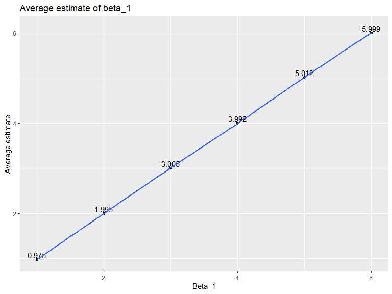

Homework 5
================
Yiyang LIU
2019/11/6

# Problem 1

``` r
set.seed(10)

iris_with_missing = iris %>% 
  map_df(~replace(.x, sample(1:150, 20), NA)) %>%
  mutate(Species = as.character(Species))

# write a function

fill = function(x) {
   if (is.numeric(x)) {
    a = mean(x, na.rm = TRUE)
    x = replace_na(x, a)
  }else if (is.character(x)) {
    x = replace_na(x, "virginica")
  }
   x
}

# apply the function to columns of dataset

iris_fill = map_df(.x = iris_with_missing, ~ fill(.x))

iris_fill
```

    ## # A tibble: 150 x 5
    ##    Sepal.Length Sepal.Width Petal.Length Petal.Width Species
    ##           <dbl>       <dbl>        <dbl>       <dbl> <chr>  
    ##  1         5.1          3.5         1.4         0.2  setosa 
    ##  2         4.9          3           1.4         0.2  setosa 
    ##  3         4.7          3.2         1.3         0.2  setosa 
    ##  4         4.6          3.1         1.5         1.19 setosa 
    ##  5         5            3.6         1.4         0.2  setosa 
    ##  6         5.4          3.9         1.7         0.4  setosa 
    ##  7         5.82         3.4         1.4         0.3  setosa 
    ##  8         5            3.4         1.5         0.2  setosa 
    ##  9         4.4          2.9         1.4         0.2  setosa 
    ## 10         4.9          3.1         3.77        0.1  setosa 
    ## # ... with 140 more rows

# Problem 2

  - Start with a dataframe containing all file names

<!-- end list -->

``` r
filename = tibble(file_name = list.files("./data"))
```

  - Iterate over file names and read in data for each subject using
    `purrr::map` and saving the result as a new variable in the
    dataframe

<!-- end list -->

``` r
path = vector("list", length = 20)

for (i in 1:20) {
  path[i] = str_c("./data/", filename[i,1])
}

data = map(path, read_csv)
```

    ## Parsed with column specification:
    ## cols(
    ##   week_1 = col_double(),
    ##   week_2 = col_double(),
    ##   week_3 = col_double(),
    ##   week_4 = col_double(),
    ##   week_5 = col_double(),
    ##   week_6 = col_double(),
    ##   week_7 = col_double(),
    ##   week_8 = col_double()
    ## )
    ## Parsed with column specification:
    ## cols(
    ##   week_1 = col_double(),
    ##   week_2 = col_double(),
    ##   week_3 = col_double(),
    ##   week_4 = col_double(),
    ##   week_5 = col_double(),
    ##   week_6 = col_double(),
    ##   week_7 = col_double(),
    ##   week_8 = col_double()
    ## )
    ## Parsed with column specification:
    ## cols(
    ##   week_1 = col_double(),
    ##   week_2 = col_double(),
    ##   week_3 = col_double(),
    ##   week_4 = col_double(),
    ##   week_5 = col_double(),
    ##   week_6 = col_double(),
    ##   week_7 = col_double(),
    ##   week_8 = col_double()
    ## )
    ## Parsed with column specification:
    ## cols(
    ##   week_1 = col_double(),
    ##   week_2 = col_double(),
    ##   week_3 = col_double(),
    ##   week_4 = col_double(),
    ##   week_5 = col_double(),
    ##   week_6 = col_double(),
    ##   week_7 = col_double(),
    ##   week_8 = col_double()
    ## )
    ## Parsed with column specification:
    ## cols(
    ##   week_1 = col_double(),
    ##   week_2 = col_double(),
    ##   week_3 = col_double(),
    ##   week_4 = col_double(),
    ##   week_5 = col_double(),
    ##   week_6 = col_double(),
    ##   week_7 = col_double(),
    ##   week_8 = col_double()
    ## )
    ## Parsed with column specification:
    ## cols(
    ##   week_1 = col_double(),
    ##   week_2 = col_double(),
    ##   week_3 = col_double(),
    ##   week_4 = col_double(),
    ##   week_5 = col_double(),
    ##   week_6 = col_double(),
    ##   week_7 = col_double(),
    ##   week_8 = col_double()
    ## )
    ## Parsed with column specification:
    ## cols(
    ##   week_1 = col_double(),
    ##   week_2 = col_double(),
    ##   week_3 = col_double(),
    ##   week_4 = col_double(),
    ##   week_5 = col_double(),
    ##   week_6 = col_double(),
    ##   week_7 = col_double(),
    ##   week_8 = col_double()
    ## )
    ## Parsed with column specification:
    ## cols(
    ##   week_1 = col_double(),
    ##   week_2 = col_double(),
    ##   week_3 = col_double(),
    ##   week_4 = col_double(),
    ##   week_5 = col_double(),
    ##   week_6 = col_double(),
    ##   week_7 = col_double(),
    ##   week_8 = col_double()
    ## )
    ## Parsed with column specification:
    ## cols(
    ##   week_1 = col_double(),
    ##   week_2 = col_double(),
    ##   week_3 = col_double(),
    ##   week_4 = col_double(),
    ##   week_5 = col_double(),
    ##   week_6 = col_double(),
    ##   week_7 = col_double(),
    ##   week_8 = col_double()
    ## )
    ## Parsed with column specification:
    ## cols(
    ##   week_1 = col_double(),
    ##   week_2 = col_double(),
    ##   week_3 = col_double(),
    ##   week_4 = col_double(),
    ##   week_5 = col_double(),
    ##   week_6 = col_double(),
    ##   week_7 = col_double(),
    ##   week_8 = col_double()
    ## )
    ## Parsed with column specification:
    ## cols(
    ##   week_1 = col_double(),
    ##   week_2 = col_double(),
    ##   week_3 = col_double(),
    ##   week_4 = col_double(),
    ##   week_5 = col_double(),
    ##   week_6 = col_double(),
    ##   week_7 = col_double(),
    ##   week_8 = col_double()
    ## )
    ## Parsed with column specification:
    ## cols(
    ##   week_1 = col_double(),
    ##   week_2 = col_double(),
    ##   week_3 = col_double(),
    ##   week_4 = col_double(),
    ##   week_5 = col_double(),
    ##   week_6 = col_double(),
    ##   week_7 = col_double(),
    ##   week_8 = col_double()
    ## )
    ## Parsed with column specification:
    ## cols(
    ##   week_1 = col_double(),
    ##   week_2 = col_double(),
    ##   week_3 = col_double(),
    ##   week_4 = col_double(),
    ##   week_5 = col_double(),
    ##   week_6 = col_double(),
    ##   week_7 = col_double(),
    ##   week_8 = col_double()
    ## )
    ## Parsed with column specification:
    ## cols(
    ##   week_1 = col_double(),
    ##   week_2 = col_double(),
    ##   week_3 = col_double(),
    ##   week_4 = col_double(),
    ##   week_5 = col_double(),
    ##   week_6 = col_double(),
    ##   week_7 = col_double(),
    ##   week_8 = col_double()
    ## )
    ## Parsed with column specification:
    ## cols(
    ##   week_1 = col_double(),
    ##   week_2 = col_double(),
    ##   week_3 = col_double(),
    ##   week_4 = col_double(),
    ##   week_5 = col_double(),
    ##   week_6 = col_double(),
    ##   week_7 = col_double(),
    ##   week_8 = col_double()
    ## )
    ## Parsed with column specification:
    ## cols(
    ##   week_1 = col_double(),
    ##   week_2 = col_double(),
    ##   week_3 = col_double(),
    ##   week_4 = col_double(),
    ##   week_5 = col_double(),
    ##   week_6 = col_double(),
    ##   week_7 = col_double(),
    ##   week_8 = col_double()
    ## )
    ## Parsed with column specification:
    ## cols(
    ##   week_1 = col_double(),
    ##   week_2 = col_double(),
    ##   week_3 = col_double(),
    ##   week_4 = col_double(),
    ##   week_5 = col_double(),
    ##   week_6 = col_double(),
    ##   week_7 = col_double(),
    ##   week_8 = col_double()
    ## )
    ## Parsed with column specification:
    ## cols(
    ##   week_1 = col_double(),
    ##   week_2 = col_double(),
    ##   week_3 = col_double(),
    ##   week_4 = col_double(),
    ##   week_5 = col_double(),
    ##   week_6 = col_double(),
    ##   week_7 = col_double(),
    ##   week_8 = col_double()
    ## )
    ## Parsed with column specification:
    ## cols(
    ##   week_1 = col_double(),
    ##   week_2 = col_double(),
    ##   week_3 = col_double(),
    ##   week_4 = col_double(),
    ##   week_5 = col_double(),
    ##   week_6 = col_double(),
    ##   week_7 = col_double(),
    ##   week_8 = col_double()
    ## )
    ## Parsed with column specification:
    ## cols(
    ##   week_1 = col_double(),
    ##   week_2 = col_double(),
    ##   week_3 = col_double(),
    ##   week_4 = col_double(),
    ##   week_5 = col_double(),
    ##   week_6 = col_double(),
    ##   week_7 = col_double(),
    ##   week_8 = col_double()
    ## )

``` r
df = 
  filename %>% 
  mutate(data = data)%>% 
  unnest()
```

  - Tidy the result; manipulate file names to include control arm and
    subject ID, make sure weekly observations are “tidy”, and do any
    other tidying that’s necessary

<!-- end list -->

``` r
df_clean =
  df %>%
  separate(file_name, into = c("arm", "subject_id"), sep = "_") %>% 
  mutate(
    subject_id = str_remove(subject_id, pattern = ".csv"),
    arm = str_replace(arm, "con", "control"),
    arm = str_replace(arm, "exp", "experimental")
  ) %>% 
  pivot_longer(
    3:10,
    names_to = "week",
    names_prefix = "week_"
  ) %>% 
  mutate(
    arm = as.factor(arm),
    subject_id = as.factor(subject_id),
    week = as.factor(week)
  )
```

  - Make a spaghetti plot showing observations on each subject over
    time, and comment on differences between groups

<!-- end list -->

``` r
plot =
  df_clean %>% 
  group_by(week, arm, subject_id) %>% 
  ggplot(aes(x = week, y = value, color = subject_id))+
  geom_line(aes(group = subject_id))+
  facet_grid(.~arm)+
  labs(title = "Observations on each subject over time")

plot
```


The values in control group is almost consistant over time but the
values in experimental group have an overall increasing trend within 8
weeks.

# Problem 3

``` r
sim_regression = function(n = 30, beta0 = 2, beta1) {
  
  sim_data = tibble(
    x = rnorm(n, mean = 0, sd = 1),
    y = beta0 + beta1 * x + rnorm(n, 0, sd = sqrt(50))
  )
  
  ls_fit = lm(y ~ x, data = sim_data)
  broom::tidy(ls_fit) %>% 
  filter(term == "x") %>% 
  select(estimate, p.value)
}

results = rerun(10000, sim_regression(30, 2, 0)) %>% 
  bind_rows()
```

``` r
output = vector("list", length = 6)

for (i in c(1,2,3,4,5,6)) {
  output[[i]] = rerun(10000, sim_regression(beta1 = i))
  output[[i]] = bind_rows(output[[i]])
}

sim_results = 
  tibble(
    beta_1 = c(1, 2, 3, 4, 5, 6),
    output = output) %>% 
    unnest(output) %>% 
  mutate(
    result = ifelse(p.value < 0.05, "reject", "accept")
  ) 

data_reject = 
  sim_results %>% 
  group_by(beta_1, result) %>% 
  summarise(n = n()) %>% 
  pivot_wider(
    names_from = result,
    values_from = n
  ) %>% 
  mutate(
    total = accept + reject,
    reject_rate = reject/total
  )

ggplot(data_reject, aes(x = beta_1, y = reject_rate)) +
  geom_point() +
  geom_text(aes(y = reject_rate + 0.1, label = reject_rate)) +
  geom_smooth(se = FALSE)+
  labs(
    title = "Association between power and true beta_1 value",
    x = "True beta_1 value",
    y = "Power"
  ) 
```

    ## `geom_smooth()` using method = 'loess' and formula 'y ~ x'


Effect size is the difference between true beta\_1 value and beta\_0
which is 0. Therefore, x axis is the effect size and y is the power. We
can see that power increases with effect size increasing.

``` r
data_mean = sim_results %>% 
  group_by(beta_1) %>% 
  summarise(
    mean = round(mean(estimate),3)
  )

ggplot(data_mean, aes(x = beta_1, y = mean)) +
  geom_point() +
  geom_text(aes(y = mean + 0.1, label = mean)) +
  geom_smooth(se = FALSE)+
  labs(
    title = "Average estimate of beta_1",
    x = "Beta_1",
    y = "Average estimate"
  ) 
```

    ## `geom_smooth()` using method = 'loess' and formula 'y ~ x'



``` r
data_mean_reject = sim_results %>% 
  filter(result == "reject") %>% 
  group_by(beta_1) %>% 
  summarise(
    mean = round(mean(estimate),3)
  )

ggplot(data_mean_reject, aes(x = beta_1, y = mean)) +
  geom_point() +
  geom_text(aes(y = mean + 0.1, label = mean)) +
  geom_smooth(se = FALSE) +
  labs(
    title = "Average estimate of beta_1 in rejected group",
    x = "Beta_1",
    y = "Average estimate"
  )
```

    ## `geom_smooth()` using method = 'loess' and formula 'y ~ x'


